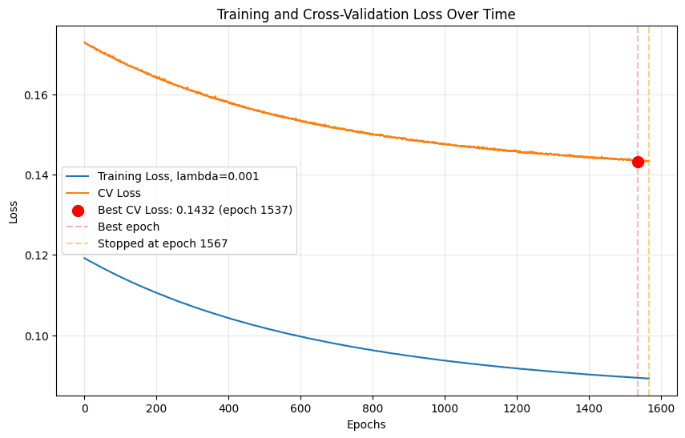

# MNIST Neural Network From Scratch

Building a fully-connected neural network from first principles using only NumPy—no ML frameworks like PyTorch or TensorFlow.

## 🎯 Project Overview

This project implements a 4-layer neural network (784→512→256→128→10) to classify handwritten digits from the MNIST dataset, achieving **97.94% validation accuracy** through systematic hyperparameter tuning.

> **Note**: This is an ongoing learning project and may be updated with additional experiments, optimizations, or model variations in the future.

### Architecture
- **Input Layer**: 784 features (28×28 pixel images)
- **Hidden Layers**: 3 layers (512, 256, 128 neurons) with ReLU activation
- **Output Layer**: 10 neurons with softmax activation
- **Loss Function**: Cross-entropy with L2 regularization
- **Optimization**: Mini-batch gradient descent (batch_size=64)

## 📊 Performance

| Metric | Result |
|--------|--------|
| **Validation Accuracy** | 97.94% |
| **Training Accuracy** | 99.97% |
| **Test Set Size** | 7,000 examples |
| **Optimal λ (L2 reg)** | 0.001 |
| **Learning Rate (α)** | 0.001 |

### Hyperparameter Search Results

Systematic experimentation across λ values (with α=0.001 held constant):

| Lambda | CV Accuracy | Loss Gap |
|--------|-------------|----------|
| 0.001 ✓ | 97.94% | 60.6% |
| 0.00005 | 97.69% | 111.8% |
| 0.0001 | 97.63% | 77.0% |

## 🔧 Implementation Details

### Features
- **Vectorized Operations**: All computations use NumPy arrays for efficiency
- **He Initialization**: Weights scaled by √(2/n_in) for ReLU stability
- **Numerical Stability**: Log-sum-exp trick for softmax
- **Early Stopping**: Patience-based stopping with best weight restoration
- **L2 Regularization**: Prevents overfitting on 56K training examples

### Training Configuration
```python
epochs = 2000 (with early stopping)
batch_size = 64
alpha = 0.001          # learning rate
lambda = 0.001         # L2 regularization strength
patience = 30          # early stopping patience
tolerance = 1e-6       # floating-point tolerance
```

## 📁 Project Structure

```
ml-practice/
├── notebook/
│   └── mnist_from_scratch.ipynb    # Main implementation
├── experiments/
│   ├── info.txt                     # Experimental results
│   └── *.png                        # Training curves
├── practice/
│   ├── day1_numpy_drills.py        # NumPy fundamentals
│   └── numpy_check.py              # Practice tests
└── README.md
```

## 🚀 Getting Started

### Prerequisites
```bash
pip install numpy matplotlib scikit-learn jupyter
```

### Run the Notebook
```bash
cd notebook
jupyter notebook mnist_from_scratch.ipynb
```

### Dataset
The MNIST dataset (70,000 images) is automatically downloaded via `sklearn.datasets.fetch_openml`. The data is split into:
- Training: 56,000 (80%)
- Validation: 7,000 (10%)
- Test: 7,000 (10%)

## 📈 Training Visualization

Training curves show CV loss converging around epoch 150-200 with early stopping at optimal performance:



## 🔍 Key Insights

1. **Loss vs Accuracy**: Lower loss doesn't guarantee better accuracy—cross-entropy measures confidence, not correctness
2. **Regularization Impact**: Stronger regularization (higher λ) improved generalization within tested range (0.00005-0.001)
3. **Accuracy Gap**: Used accuracy gap (train - CV) as primary metric for overfitting detection
4. **Hyperparameter Coupling**: Learning rate and regularization strength interact—must keep α constant when comparing λ values

## 📝 Learning Outcomes

- Implemented backpropagation from scratch with gradient checking
- Debugged numerical instability issues (softmax overflow)
- Systematic hyperparameter search methodology
- Understanding of regularization trade-offs
- Early stopping implementation for efficient training

## 🎓 Context

This project was built as part of self-study in machine learning fundamentals, focusing on understanding the math and mechanics behind neural networks before moving to frameworks like PyTorch.

## 📊 Next Steps

- [ ] Evaluate final model on held-out test set
- [ ] Implement momentum/Adam optimizer
- [ ] Add dropout regularization
- [ ] Port to PyTorch for comparison
- [ ] Visualize learned features in hidden layers

---

**Note**: Bayes/human error rate for MNIST is approximately 0.2%. Current model achieves ~2.06% error rate on validation set.